# Entity Relationship Diagram

Covers **all 25 milestones**, per `MILESTONE_04_PLAN.md` → AD-6. Drawing the whole graph
now is what protects the Tier-1 spine from a surprise at Milestone 17 — the design is
the protection, not the migration.

Created: 2026-08-02 (Milestone 4)

## How to read this

| Marker | Meaning |
|---|---|
| **Tier 1** | Designed *and* migrated in Milestone 4. Milestones 5–14, plus `branches`. |
| **Tier 2** | Designed here, migrated at its own milestone. Columns are indicative — the owning milestone has the real requirements. Only the foreign keys into the spine are load-bearing. |

Split by domain deliberately. A single 85-entity diagram renders as spaghetti and would
be read by nobody.

Attributes below are **keys and defining columns only**. Every Tier-1 table also carries
the cross-cutting columns from `MILESTONE_04_PLAN.md` → Database Impact
(`organization_id`, `branch_id` where branch-scoped, `created_at`, `updated_at`,
`deleted_at`, `version`), omitted per-entity here to keep the diagrams legible. Full
column detail lives in `schema-change.md`.

**Table count: 85.** 10 existing (milestones 1–2), 50 Tier 1, 25 Tier 2. The plan
estimated ~75 before the derivation was done; this diagram is authoritative.

83 of the 85 are drawn below. `verifications` and `health_checks` are omitted because
they hold no foreign keys in either direction — drawing an entity with no edges adds
nothing. They are counted, not forgotten.

---

## Overview — domains and how they connect

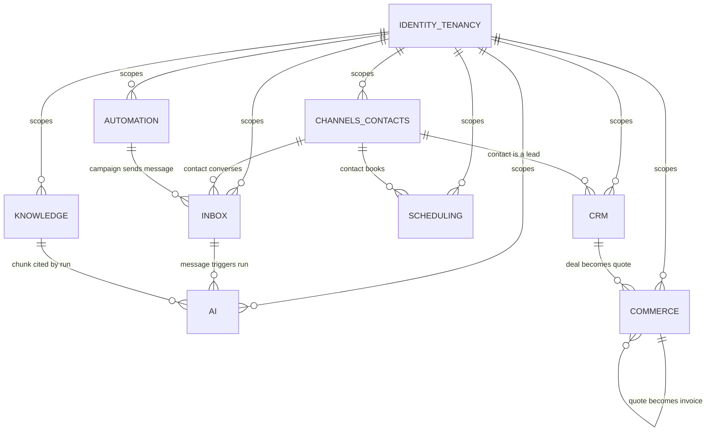

---

## 1. Identity and tenancy — existing, plus `branches`

`branches` is the only new table here, and it is the structural centre of the milestone.

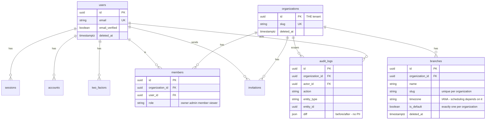

**Notes**

- `branches.timezone` is not decoration. Milestone 9 requires availability, conflicts,
  and reminders per branch; a branch without its own timezone cannot express "9am local"
  for a two-city business.
- `is_default` marks the auto-provisioned `Main` branch. A partial unique index enforces
  exactly one per organization.
- Members are org-level, not branch-level. Branch-level *permissions* are a Milestone 18
  concern; the isolation boundary is built now, the access control on top of it is not.
- `audit_logs.diff` is added this milestone — `DATABASE_RULES.md:83` requires before/after
  and the current model carries only `metadata`.

---

## 2. Channels and contacts — Tier 1

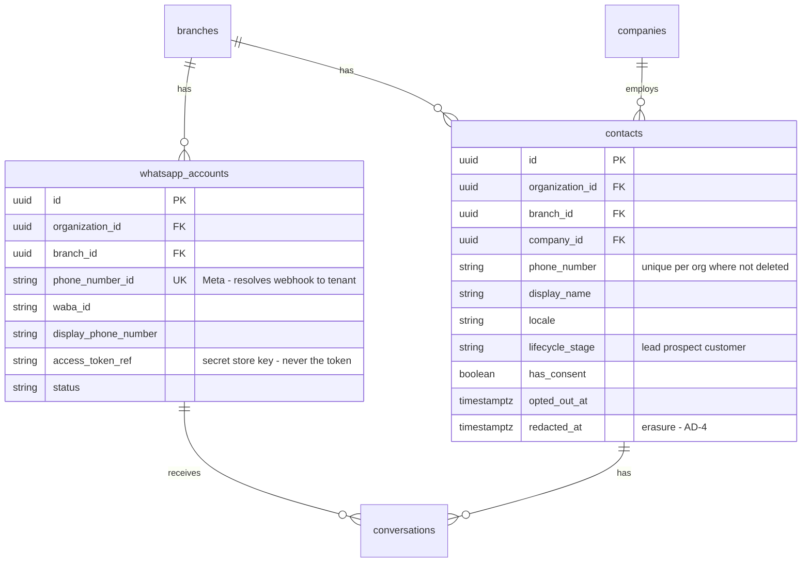

**Notes**

- `whatsapp_accounts.phone_number_id` is how an inbound webhook resolves to a tenant.
  `DATABASE_RULES.md:106` requires tenancy to come from the session *or* the WhatsApp
  phone number id and never from a request body — this column is that second path, so it
  is globally unique, not unique-per-org.
- The access token is **not** stored here. The column holds a reference into the secret
  store.
- One `contacts` table, not Contact (M6) and Customer (M10). `lifecycle_stage` carries
  the distinction. Two tables would mean two identities for one person.
- `redacted_at` is the erasure marker from AD-4. Distinct from `deleted_at`, which is
  trash-and-restore.

---

## 3. Inbox — Tier 1, Milestone 6

The hot path. Every index decision here matters more than anywhere else in the schema.

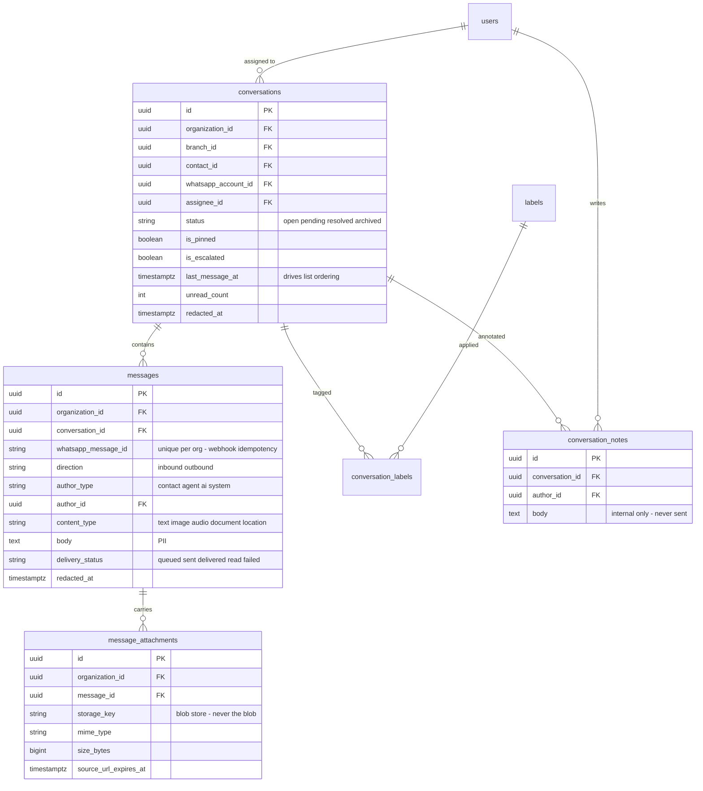

**Notes**

- `uq_messages_organization_id_whatsapp_message_id` is what makes webhook processing
  idempotent under Meta's retries. Named explicitly in `DATABASE_RULES.md:120`.
- `message_attachments.storage_key` — `DATABASE_RULES.md:179` forbids blobs in Postgres.
  `source_url_expires_at` records that WhatsApp media URLs are short-lived, so the copy
  step is visible in the schema rather than discovered at Milestone 6.
- `messages.body` and `conversations`/`messages.redacted_at` are the PII surface that
  AD-4's erasure path targets.
- `conversations.last_message_at` is denormalised on purpose: the inbox list orders by it
  and computing it from `messages` per row is the N+1 that would define this product's
  performance.
- Typing indicators and read receipts are **not** tables. They are ephemeral realtime
  state and belong in Redis at Milestone 24, not in Postgres.

---

## 4. Knowledge base — Tier 1, Milestone 7

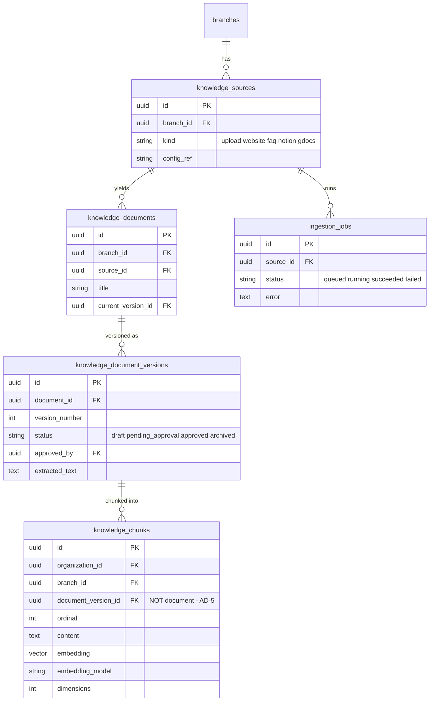

**Notes**

- Chunks hang off a **version**, not a document. Milestone 7 requires approval, so
  retrieval must be able to see only approved versions — inexpressible if chunks point
  at the document. This is AD-5 and it is the single most consequential shape decision
  in this domain.
- `embedding_model` and `dimensions` on the chunk make re-embedding a job rather than a
  redesign. Vectors from different models are not comparable, so a model change
  invalidates every row regardless.
- `embedding` is `Unsupported("vector(1536)")` in Prisma and is queried via `$queryRaw`.
  Not type-safe through Prisma; normal, and recorded so it is not read as an oversight.
- HNSW index on `embedding`, scoped by `branch_id` — branches have separate knowledge
  per Milestone 18.

---

## 5. AI engine — Tier 1, Milestone 8

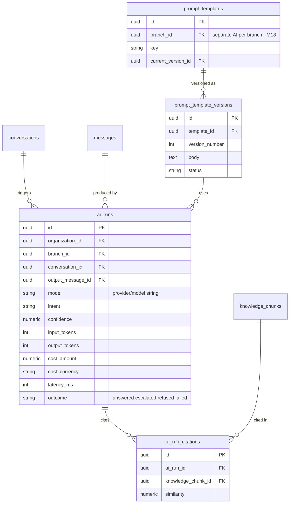

**Notes**

- `ai_runs` is where Milestone 8's confidence, hallucination, and fallback signals land,
  and it is also what Milestone 22's "AI Usage" reads. Designing it once, now, avoids
  Milestone 22 inventing a parallel usage table.
- Citations are a table, not a JSON column, because Milestone 8 requires citation and
  Milestone 7 requires knowing which chunks earn their keep. A JSON blob answers neither
  query.
- Cost carries its own currency, per AD-3 — model pricing is USD while the tenant may
  bill in SAR.

---

## 6. Scheduling — Tier 1, Milestone 9

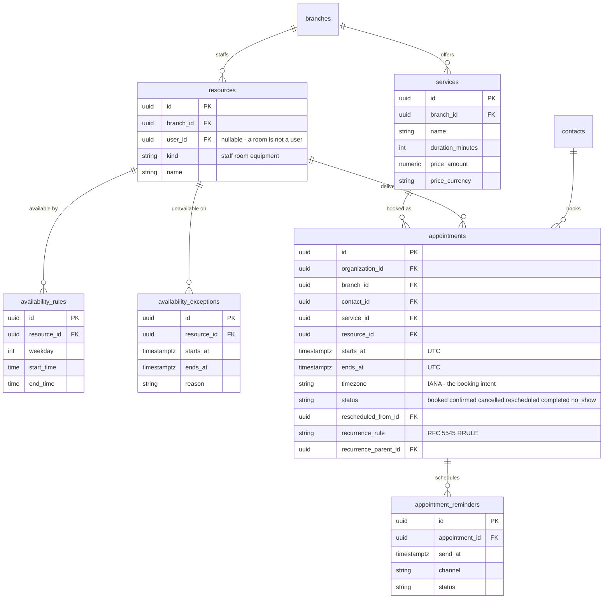

**Notes**

- Both a UTC instant **and** an IANA timezone. Storing only UTC loses the booking
  intent: if a government shifts a DST rule, "9am local next month" must still mean 9am
  local. `DATABASE_RULES.md:122` mandates `timestamptz` UTC; the timezone column is what
  makes it recoverable.
- `resources` covers staff, rooms, and equipment. `user_id` is nullable because a
  treatment room has no login — one of the few nullable columns with a justification.
- Recurrence as an RRULE string plus a parent link, so an exception to one occurrence
  does not require materialising every future instance.
- Conflict detection needs an exclusion constraint on overlapping ranges per resource.
  Noted here; specified in `schema-change.md`.

---

## 7. CRM and work management — Tier 1, Milestones 5 and 10

```mermaid
erDiagram
    branches ||--o{ companies : has
    branches ||--o{ pipelines : has
    pipelines ||--o{ pipeline_stages : contains
    pipeline_stages ||--o{ deals : holds
    contacts ||--o{ deals : "is party to"
    companies ||--o{ deals : "is party to"
    tags ||--o{ taggables : applied
    contacts ||--o{ activities : "subject of"
    deals ||--o{ activities : "subject of"
    users ||--o{ tasks : "assigned"
    users ||--o{ notifications : receives

    companies {
        uuid id PK
        uuid branch_id FK
        string name
        string vat_number "M12 invoicing"
    }
    pipelines {
        uuid id PK
        uuid branch_id FK
        string name
    }
    pipeline_stages {
        uuid id PK
        uuid pipeline_id FK
        string name
        int position
        numeric win_probability
    }
    deals {
        uuid id PK
        uuid organization_id FK
        uuid branch_id FK
        uuid contact_id FK
        uuid company_id FK
        uuid stage_id FK
        string title
        numeric value_amount
        string value_currency
        string status "open won lost"
        timestamptz closed_at
    }
    tags {
        uuid id PK
        uuid branch_id FK
        string name
        string color
    }
    taggables {
        uuid id PK
        uuid tag_id FK
        string taggable_type "contact deal conversation"
        uuid taggable_id
    }
    activities {
        uuid id PK
        uuid branch_id FK
        string subject_type
        uuid subject_id
        string kind "note call email stage_change"
        uuid actor_id FK
        text body
    }
    tasks {
        uuid id PK
        uuid branch_id FK
        uuid assignee_id FK
        string title
        timestamptz due_at
        string status
    }
    notifications {
        uuid id PK
        uuid organization_id FK
        uuid user_id FK
        string kind
        string entity_type
        uuid entity_id
        timestamptz read_at
    }
```

**Notes**

- `taggables` and `activities` are polymorphic — a deliberate exception to
  `DATABASE_RULES.md:118` ("foreign keys always"), because a tag applies to contacts,
  deals, and conversations alike and a join table per target would be three tables that
  grow to six. The trade-off costs referential integrity on that column and is called
  out in `schema-change.md` rather than slipped in. A `CHECK` constraint restricts
  `taggable_type` to the known set.
- `deals` is the CRM entity Milestone 10 calls a Lead. One table; `status` and the stage
  carry the distinction.
- `tasks` and `notifications` originate in Milestone 5's dashboard, not Milestone 10.

---

## 8. Commerce — Tier 1, Milestones 11 and 12

Every money column is `numeric(15,4)` with a sibling currency column, per AD-3.

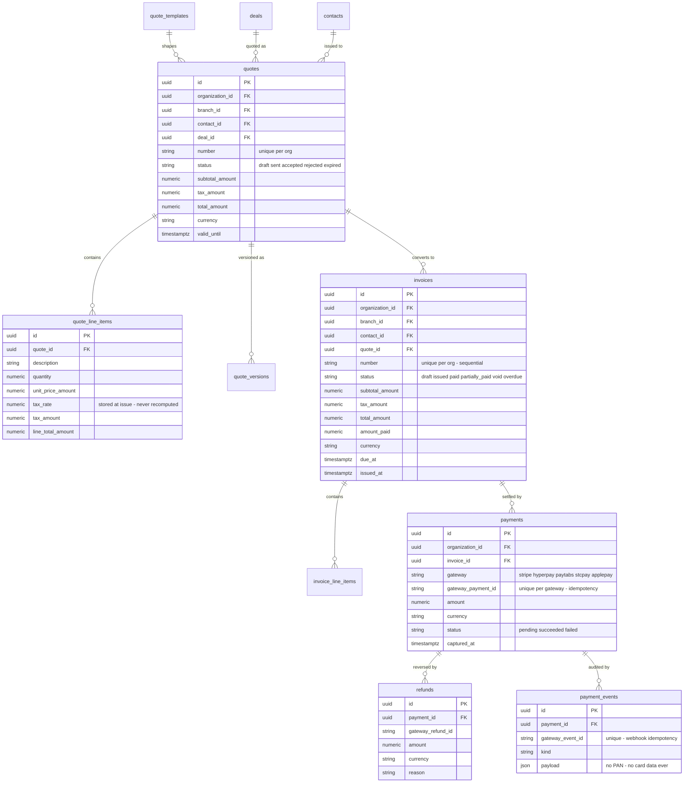

**Notes**

- `tax_rate` **and** `tax_amount` are stored on every line, at issue time. A historical
  invoice is never recomputed from today's rate. Saudi VAT moved 5% → 15% in 2020; a
  system that recomputes silently rewrites its own history. AD-3.
- `payments.gateway_payment_id` and `payment_events.gateway_event_id` are unique — five
  gateways all retry their webhooks, and idempotency has to be structural, not
  best-effort.
- `payment_events.payload` never holds card data. Storing a PAN would put this system in
  PCI scope; the schema forecloses it.
- Invoice numbers are sequential per organization and legally must not have gaps in
  several jurisdictions. That is a generation concern for Milestone 12; the uniqueness
  constraint is set here.

---

## 9. Automation — Tier 1, Milestones 13 and 14

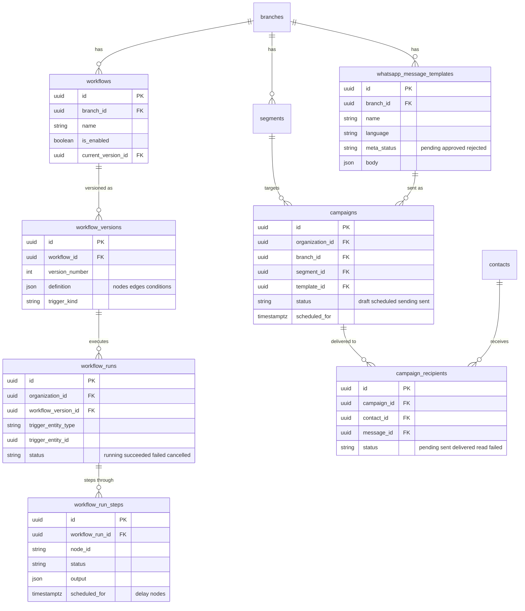

**Notes**

- The workflow graph is JSON on a version row, not `workflow_nodes` and `workflow_edges`
  tables. A visual builder edits the whole graph atomically; normalising it buys
  referential integrity nobody queries and costs a multi-table transaction on every
  save. The version row makes edits auditable, which is the actual requirement.
- `whatsapp_message_templates.meta_status` exists because Meta must approve template
  content before it can be sent. A broadcast system that discovers this at send time is
  a broadcast system that does not send.
- `campaign_recipients.message_id` links back to `messages`, so a broadcast and a
  conversation are the same message stream — not a parallel one.

---

## 10. Tier 2 — designed now, migrated at their own milestone

Columns here are **indicative**. The foreign keys into the spine are the load-bearing
part: they are what this diagram exists to surface, and they are why the Tier-1 tables
above are shaped as they are.

```mermaid
erDiagram
    contacts ||--o{ review_requests : "asked of"
    review_requests ||--o{ reviews : yields
    review_platforms ||--o{ reviews : hosts
    integration_connections ||--o{ webhook_endpoints : exposes
    integration_connections ||--o{ sync_cursors : tracks
    agents ||--o{ agent_tools : grants
    organizations ||--o{ feature_flags : toggles
    contacts ||--o{ data_export_requests : "subject of"
    contacts ||--o{ loyalty_accounts : holds
    loyalty_programs ||--o{ loyalty_accounts : governs
    loyalty_accounts ||--o{ loyalty_transactions : records
    invoices ||--o{ loyalty_transactions : earns
    appointments ||--o{ loyalty_transactions : earns
    coupons ||--o{ coupon_redemptions : redeemed
    contacts ||--o{ referrals : refers
    branches ||--o{ integration_connections : connects
    integration_connections ||--o{ webhook_deliveries : delivers
    message_attachments ||--o{ transcriptions : "transcribed as"
    messages ||--o{ tts_renders : "spoken as"
    branches ||--o{ agents : configures
    agents ||--o{ agent_versions : "versioned as"
    ai_runs ||--o{ agent_handoffs : "hands off"
    plans ||--o{ subscriptions : "sold as"
    organizations ||--o{ subscriptions : buys
    organizations ||--o{ usage_records : accrues
    contacts ||--o{ data_erasure_requests : "subject of"

    review_requests {
        uuid id PK
        uuid contact_id FK
        uuid appointment_id FK
        string platform "google facebook"
    }
    loyalty_transactions {
        uuid id PK
        uuid loyalty_account_id FK
        uuid invoice_id FK
        uuid appointment_id FK
        int points_delta
    }
    integration_connections {
        uuid id PK
        uuid branch_id FK
        string provider
        string credentials_ref "encrypted at rest - never plaintext"
    }
    transcriptions {
        uuid id PK
        uuid message_attachment_id FK
        text text "PII - erasure applies"
        string model
    }
    agents {
        uuid id PK
        uuid branch_id FK
        string kind "reception sales support marketing analytics billing manager knowledge"
    }
    subscriptions {
        uuid id PK
        uuid organization_id FK
        uuid plan_id FK
        string status
    }
    data_erasure_requests {
        uuid id PK
        uuid contact_id FK
        string status
        timestamptz completed_at
    }
```

**What this diagram already told us**, and why it was worth drawing before migrating:

1. **Loyalty points reference both invoices and appointments.** Neither Tier-1 table
   needed changing — but had loyalty been designed at Milestone 17 in isolation, the
   obvious shortcut is a `loyalty_transactions.amount` column duplicating invoice
   totals. The FK is correct and now it is on the record.
2. **Transcriptions hold PII** (Milestone 20). The erasure path built this milestone must
   be extensible to tables that do not exist yet — so erasure is driven by a registry of
   redactable columns, not a hardcoded list. That is a Tier-1 design change caused
   entirely by a Tier-2 table.
3. **`agents` is branch-scoped** — Milestone 18's "Separate AI." It also means Milestone
   21's agents and Milestone 8's `prompt_templates` are the same shape, so Milestone 21
   extends rather than replaces.
4. **Loyalty accounts belong to a contact, not a branch** — which raises the cross-branch
   question (earn at Riyadh, redeem at Jeddah). Flagged for Milestone 17. **Not decided
   here**, and deliberately not guessed at.
5. **`subscriptions` hangs off `organizations`, never `branches`.** Billing is per
   contract, not per location. Had this been designed at Milestone 22 alongside a
   branch-heavy schema, per-branch billing is the easy wrong turn.

---

## Cross-cutting mechanisms

Applied uniformly rather than per-table, so they cannot be forgotten:

| Mechanism | Applies to | Enforced by |
|---|---|---|
| Org scoping | every business table | Prisma client extension (AD-2) + RLS |
| Branch scoping | every branch-scoped table | the same extension |
| Soft delete | every user-facing table | base repository default filter |
| Erasure / redaction | tables with PII columns | redactable-column registry (AD-4) |
| Optimistic locking | concurrently-edited entities | `version` checked on update, 409 on stale |
| History | quotes, invoices, knowledge documents, workflows, prompts, agents | `<entity>_versions` tables |
| Audit | see `DATABASE_RULES.md:86` | append-only `audit_logs`, no update or delete path |
